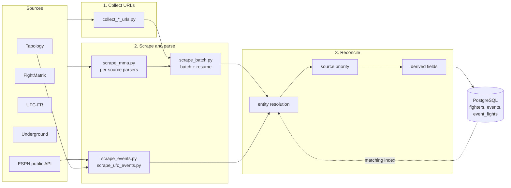

# mma-scraper

A multi-source scraping pipeline that collects MMA fighter profiles, fight histories and event results, reconciles them across sources, and keeps a PostgreSQL database up to date incrementally.

Written in Python (requests, BeautifulSoup, Selenium, Playwright, psycopg2). Run against the real sources, it built and maintained a database of **12,000+ fighters, 8,700+ events and 58,000+ bouts**.

> **Portfolio project.** No scraped data is included in this repository. Read [Responsible use](#responsible-use) before running it.

---

## Why this is more than a script

Scraping one page is easy. Keeping a database *correct* when five sources disagree, one of them blocks bots, and the same fighter is spelled three different ways is the actual problem. This project is built around that.

| Problem | How it is handled |
|---|---|
| **Sources contradict each other** (records, histories, nationality) | A fixed **source-priority hierarchy** decides who wins: `Tapology > UFC Stats / event results > UFC-FR = UFC.com = FightMatrix > Underground`. A higher-priority history overwrites the stored record even if it lists *fewer* fights (this removes phantom fights). Lower-priority sources only fill gaps. |
| **Same fighter, different spelling / missing data** | Layered **entity resolution**: normalized name + date of birth, then a source-URL index, then DOB + name-token subset (`"Jose Aldo"` vs `"Jose Aldo Jr"`), then a ±90-day DOB tolerance, then corroboration by shared opponents. Ambiguous cases are **skipped, never merged blindly**. |
| **Re-scraping must not destroy good data** | Every column follows one of three write policies: *always refresh* (records, ranks), *authoritative-source overwrite* (e.g. nationality only from UFC-FR/UFC), or *fill-if-empty* (`COALESCE`). Derived values (record split, totals, quality score) are recomputed on the **merged** database state, not on a single scrape. |
| **Cloudflare / bot protection** | A shared real Chrome session (undetected-chromedriver) keeps the clearance cookie across pages; Playwright + stealth for JS-rendered event pages; cloudscraper and proxy support as fallbacks. A **circuit breaker** pauses the batch after N consecutive failures (likely a banned IP) instead of burning hours on requests that cannot succeed. |
| **Long runs get interrupted** | Batches are **resumable** (`--resume` progress files), failed URLs are logged and retried, dropped database connections are re-opened, and the maintenance scripts that modify data are **dry-run by default** (`--commit` to apply). |
| **JS-rendered pages load in stages** | The fighter bio appears in ~1 s but the fight list renders seconds later. The scraper waits until the bout count is non-zero *and stable* before capturing, which fixed silently truncated histories. |
| **Non-MMA fights pollute records** | Bouts are filtered by discipline badge (MMA vs kickboxing, boxing, Muay Thai, grappling), with an event-name fallback. |

---

## Architecture



## Data sources

| Source | What it provides | Access method |
|---|---|---|
| **Tapology** | Bio, photo, complete fight history with opponent record at the time of each bout, event cards | Real Chrome (Selenium), Playwright for events |
| **FightMatrix** | Rating points, historical rankings, career record, DOB | HTML (requests / cloudscraper) |
| **UFC-FR** | Nationality, style, official rank, champion status, UFC record | HTML (requests) |
| **Underground** | Win/loss method breakdown | HTML |
| **UFC.com** | Stance, first sport | HTML |
| **ESPN core API** | Event results, athlete bio (DOB, height, reach, stance) | Public JSON API |

## Project layout

```
mma-scraper/
├── scraper/
│   ├── scrape_mma.py          # per-source parsers + fetch layer (Selenium / cloudscraper / proxy)
│   ├── parse_misc.py          # derived fields: age, streak, league, weight-class history, ...
│   ├── scrape_mma_supabase.py # upsert logic, write policies, recomputation, entity resolution
│   ├── scrape_batch.py        # batch scraper: many URLs, resume, circuit breaker
│   ├── scrape_events.py       # Tapology / UFC-FR events -> events + event_fights, fighter updates
│   ├── scrape_ufc_events.py   # same pipeline fed by the ESPN API (UFC, PFL, Bellator)
│   ├── scrape_fm_full.py      # deep FightMatrix URL collection
│   ├── collect_*.py           # URL collectors (rankings, listings, sitemaps, search)
│   ├── espn_enrichir.py       # fill missing DOB / height / reach from ESPN (never overwrites)
│   ├── fix_duplicates.py      # detect and merge duplicate fighters
│   ├── extract_tapology_urls.py
│   └── db_connection.py
├── schema.sql                 # PostgreSQL schema (3 tables, triggers, anti-duplicate indexes)
├── requirements.txt
├── .env.example
└── data/scraper_output/       # URL lists, progress files, reports (git-ignored)
```

---

## Getting started

Requires **Python 3.10+**, **PostgreSQL** (local or hosted, e.g. Supabase) and **Google Chrome** for the Selenium-based collectors.

```bash
git clone https://github.com/kalmossa/mma-scraper.git
cd mma-scraper

python -m venv .venv
source .venv/bin/activate        # Windows: .venv\Scripts\activate
pip install -r requirements.txt
python -m playwright install chromium

cp .env.example .env             # then fill in your database credentials
createdb mma_scraper
psql -d mma_scraper -f schema.sql
python scraper/db_connection.py  # connectivity check
```

> Run every command **from the repository root**: default output paths (`data/scraper_output/...`) are relative to it.

## Usage

### 1. Collect profile URLs

Collectors write one URL per line into `data/scraper_output/<source>/`.

```bash
python scraper/collect_ufc_fr_urls.py --all                          # ~7,900 UFC-FR profiles
python scraper/collect_fm_urls.py --pages 4                          # top 100 per FightMatrix division
python scraper/collect_fm_historical.py --from-issue 60 --pages 3    # historical rankings since 2005
python scraper/collect_tapology_listings.py --mode bouts             # Tapology listing pages
python scraper/collect_tapology_smart.py --resume                    # match database fighters to Tapology (resumable)
```

### 2. Scrape a batch

The batch scraper detects the source from the URL domain and enriches fighters as it goes. **Order does not matter**: run FightMatrix today, Tapology next week.

```bash
python scraper/scrape_batch.py --file data/scraper_output/ufc_fr/collected_ufc_fr_urls.txt --resume --yes
```

For Tapology (behind Cloudflare), route fetches through a real Chrome window. Solve the captcha **by hand once**; the clearance cookie is then reused.

```bash
export SCRAPER_SELENIUM=1        # PowerShell: $env:SCRAPER_SELENIUM = "1"
python scraper/scrape_batch.py --file data/scraper_output/tapology/tapology_smart_urls.txt --resume --yes
```

`--resume` skips URLs already processed, so an interrupted run (reboot, ban) picks up exactly where it stopped.

### 3. Scrape events and keep fighters current

```bash
python scraper/collect_event_urls.py --max-urls 10000
python scraper/scrape_events.py --file data/scraper_output/tapology/event_urls.txt --commit --yes

# Cheapest way to stay up to date: one API call per event, no profile re-scrape
python scraper/scrape_ufc_events.py --recent                 # dry run
python scraper/scrape_ufc_events.py --recent --commit
python scraper/scrape_ufc_events.py --recent --league pfl --commit
```

Re-scraping thousands of profiles is wasteful: height, reach and date of birth do not change. What changes is that a fighter fought. Scraping events updates the two fighters involved (record, streak, last fight, history) with a handful of requests per week.

### 4. Maintenance

```bash
python scraper/fix_duplicates.py --include-name-only               # report only
python scraper/fix_duplicates.py --include-name-only --commit      # apply merges
python scraper/espn_enrichir.py                                    # dry run: fill gaps from ESPN
python scraper/espn_enrichir.py --commit
```

Every script has `--help`. Scripts that write to the database are **dry-run unless `--commit` is passed** (the batch scraper asks for confirmation unless `--yes`).

---

## Configuration

| Variable | Purpose |
|---|---|
| `USE_SUPABASE` | `True` targets the hosted database (`SUPABASE_*`), otherwise the local one (`DB_*`) |
| `SCRAPER_SELENIUM=1` | Fetch Tapology through a real Chrome window |
| `SCRAPER_SELENIUM_HEADLESS=1` | Hide the window (less reliable against Cloudflare) |
| `SCRAPER_PROXY` | Route all HTTP through a proxy, e.g. `socks5://127.0.0.1:9050` |
| `SCRAPER_DUMP_HTML=1` | Dump fetched HTML for debugging a parser |

## Database

Three tables (see [`schema.sql`](schema.sql)):

- **`fighters`**: identity, physical attributes, record (career / UFC / other), win methods, current league and streak, per-source metrics, provenance (`data_source`, `data_quality_score`) and the parsed `fight_history` JSON.
- **`events`**: one row per event, unique on the Tapology URL (ESPN events use an `espn-{id}` slug).
- **`event_fights`**: one row per bout, linked to both fighters.

Duplicate protection is enforced at the database level too: a unique `(name, date_of_birth)` constraint plus a unique index on the accent- and punctuation-insensitive normalized name with the date of birth.

## Known limitations

- No automated test suite yet: parsers were validated against live pages, which change. When a source redesigns its HTML, expect to touch the matching parser in `scrape_mma.py`.
- The scripts were written incrementally as the database grew. Several share helpers through cross-imports rather than a package, and some internal identifiers (mostly in the ESPN scripts) are still French. Refactoring into a proper package with `pytest` fixtures over saved HTML is the obvious next step.
- Tapology's protection is the bottleneck: expect 2-4 profiles per minute through Chrome.

## Responsible use

This repository is provided for **educational and portfolio purposes**. Sites such as Tapology and FightMatrix have terms of service and may restrict automated access; the ESPN endpoints used here are public but undocumented. Before running anything:

- read each site's terms of service and `robots.txt`, and only scrape what you are allowed to;
- keep the built-in delays, run at low volume and avoid re-scraping what has not changed;
- do not redistribute scraped data. It belongs to its sources;
- the Cloudflare handling relies on a real browser and a human solving any challenge. There is no captcha-solving service in this code.

You are responsible for how you use this software.

## License

[MIT](LICENSE)
